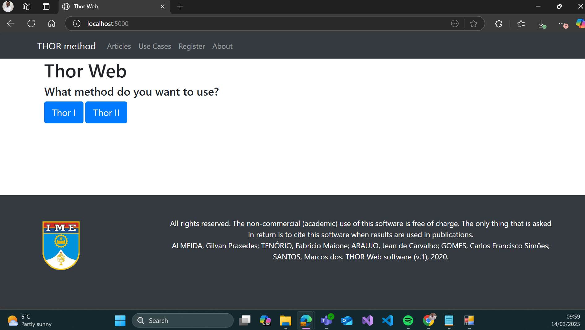

# Guia de Configuração e Execução do THOR Web

Este guia contém os passos necessários para configurar e rodar o **THOR Web** corretamente em sua máquina.

---

## 1. Pré-requisitos

Antes de começar, verifique se você tem os seguintes softwares instalados no seu computador:

✅ **Python 3.9 ou superior** → [Download Python](https://www.python.org/downloads/)
✅ **Git** → [Download Git](https://git-scm.com/downloads)
✅ **Pip (Gerenciador de pacotes do Python)** → Já vem instalado com o Python, mas pode ser atualizado com pelo cmd:

```sh
pip install --upgrade pip
```

✅ **Virtualenv (para criar ambiente virtual)**

```sh
pip install virtualenv
```

✅ **VS Code ou outro editor de código** → [Download VS Code](https://code.visualstudio.com/)

---

## 2. Clonando o Repositório

Abra o terminal (cmd, PowerShell ou terminal do VS Code) e clone o projeto:

```sh
git clone https://github.com/iamgilvan/thor-web.git
```

Acesse a pasta do projeto:

```sh
cd thor-web
```

---

## 3. Criando e Ativando um Ambiente Virtual

Para evitar conflitos entre pacotes, criamos um **ambiente virtual** antes de instalar as dependências.

### Windows

Criação:

```sh
python -m venv venv
```

Ativação:

```sh
source venv\Scripts\activate
```

### Linux/macOS

Criação:

```sh
python3 -m venv venv
```

Ativação:

```sh
source venv/bin/activate
```

Se o terminal mostrar algo como `(venv)`, significa que o ambiente virtual está ativado.

---

## 4. Instalando as Dependências

Com o ambiente virtual ativo, instale os pacotes necessários:

```sh
pip install -r requirements.txt
```

Caso o arquivo `requirements.txt` não exista, verifique a documentação do projeto para saber quais bibliotecas são necessárias.

---

## 5. Rodando o Projeto

Agora, execute o projeto com:

```sh
flask run
```

Ou:

```sh
python main.py
```

Após rodar o comando, você poderá visualizar a aplicação acessando o endereço:

```
http://localhost:5000
```

### Exemplo da Interface

Abaixo está um exemplo de como a interface do **THOR Web** deve aparecer:



---

📌 **Links úteis:**
- Como criar e usar um virtual environment: [Python Virtualenv](https://realpython.com/python-virtual-environments-a-primer/)
- Comandos básicos do Git: [Git Docs](https://git-scm.com/docs)
- Documentação oficial do Python: [Python Docs](https://docs.python.org/3/)
